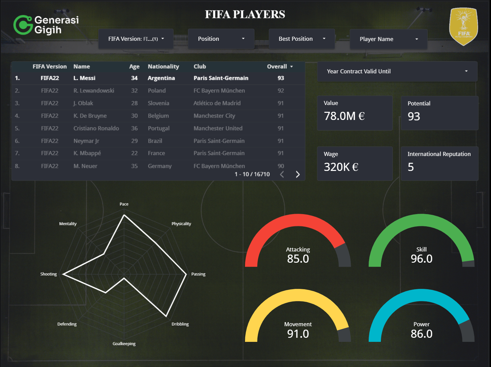

# FIFAPlayers
The aim of this project is to explore and gain insights from the FIFA video game player data, select the most interesting insights from the dataset, and solve problems for gamers.

## Problem Statement
The problem is, in the FIFA, there is no sorting tier list/rank for each role. For example, if we want to see the overall player tier list of strikers, goalkeepers, backs, etc., we usually have to search manually to see if the player in the shop is on the high tier list or not.

## About Dataset
The dataset was collected from [**here**](https://www.kaggle.com/datasets/bryanb/fifa-player-stats-database), and all the CSV files were combined with some column adjustments (preprocessing steps) using Python.

## Additional Information of the FIFA Video Game
- New gamers can get a team according to the league they choose (Premier League, Laliga, etc.).
- Gamers play to earn packs and credits (credits can be used for auctions/buying players).
- In a gamer’s FIFA team, there is also a manager who can increase the team’s chemistry stats.
- If there are players from the same country or club in one team, the team’s chemistry stats increase. This chemistry is used to swap player packs. If both the country and club are the same, the team’s chemistry stats increase even more.
- The older a player is, the faster their stamina runs out.
- Pay attention to a player’s contract status. Signing players with expiring contracts or in the final year of their deals might be more cost-effective.

## TODO's
- [x] Collecting dataset
- [x] Combining all the CSV files with some column adjustments (preprocessing steps)
- [x] Read the FIFA Stats Calculator documentation from [**here**](https://www.futbin.com/stats-calculator)

      [player stat](player_stat.png)
      
- [x] Add some calculated fields based on the FIFA Stats Calculator in Looker Studio
- [x] Develop the dashboard 

## Tech Stack
- Python
- Looker Studio

## Project Outcome
Gamers can gain a comprehensive understanding of FIFA player stats effectively and efficiently with the easy-to-use FIFA Players dashboard. Click [**here**](https://lookerstudio.google.com/reporting/000d2897-aaf8-46d9-a7f0-59155fc3b5ee) to use and explore it.

## Contributors
- Lis Wahyuni
- Mikhael Amos P.
- Mikhael Hutapea
- Nadhira Haifa F.
- Niken Hapsari
- Subkhan Rian R.
- Vincent Revel A.
